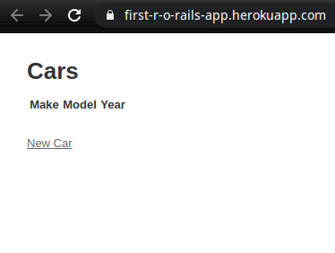

# first-ror-app

This is the first project in the Ruby on Rails course at [Microverse](https://www.microverse.org/) - @microverseinc . Creating a bot for any platform for any purpose is the purpose of this capstone project.

## Built With

- Ruby (2.6.5)
- Ruby on Rails (5.2.4.3)
- Nodejs (8.10.0)

## Description

The task is create a [basic app by using Ruby on Rails](https://www.theodinproject.com/courses/ruby-on-rails/lessons/your-first-rails-application-ruby-on-rails) . Then, the app is deployed to [Heroku](https://www.heroku.com/)

## Setup

- Clone this repository by running `git clone https://github.com/ozovalihasan/first-ror-app.git`

- Run `cd first-ror-app`

- [Install Ruby](https://www.theodinproject.com/courses/ruby-programming/lessons/installing-ruby-ruby-programming)

- Run `bundle install --without production`

- Install [Nodejs](https://nodejs.org/en/download/)

- Run `rails server`

- Go to your web browser

- Open `http://localhost:3000/cars`

- Add/remove car models

## Deploy to Heroku

- Sign up with [Heroku](https://www.heroku.com/). For details, check [The Odin Project](https://www.theodinproject.com/courses/ruby-on-rails/lessons/preparing-for-deployment)

- Create a new app from dashboard of Heroku

- Run `heroku create` on Terminal

- Check whether heroku is added or not by running `git remote`

- Run `heroku git:remote -a name-of-app`

- If any changes done, run `git add .` and `git commit -m 'update files for heroku deployment'`

- Run `git push heroku master`. If you are working with another branch,not master `git push heroku +HEAD:master`

- Run `heroku buildpacks:set https://github.com/bundler/heroku-buildpack-bundler2`

- Again, run `git push heroku master` or `git push heroku +HEAD:master`

- Run `heroku run rails db:migrate`

## Authors

👤 **Hasan Özovalı**

- Github: [@ozovalihasan](https://github.com/ozovalihasan)
- Twitter: [@ozovalihasan](https://twitter.com/ozovalihasan)
- Linkedin: [Hasan Özovalı](https://www.linkedin.com/in/hasan-ozovali/)
- Mail: [ozovalihasan@gmail.com](ozovalihasan@gmail.com)

## Acknowledgements

- [Microverse](https://www.microverse.org/)
- [The Odin Project](https://www.theodinproject.com/)

## 📝 License

This project is [MIT](https://opensource.org/licenses/MIT) licensed.
